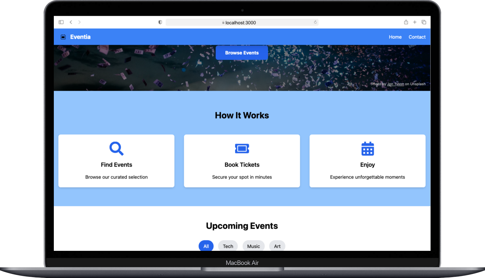
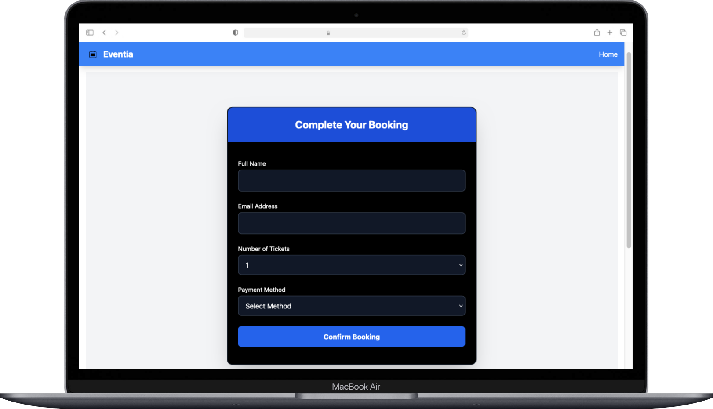
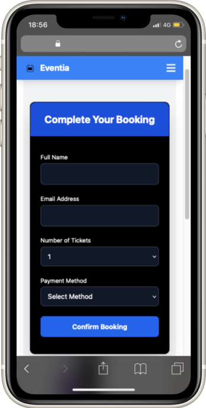
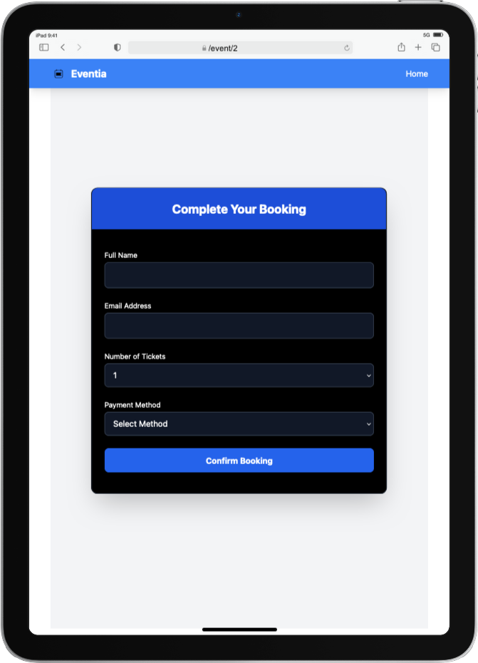

# 🎉 Eventia - Event Booking App

Eventia is a modern and minimalistic event booking platform where users can view event details and complete bookings. Built with React + TypeScript and styled using TailwindCSS.

## 🚀 Features

- View event details
- Book tickets
- Select payment method (Credit, Debit, PayPal)
- Responsive design with TailwindCSS

## 📦 Tech Stack

- React
- TypeScript
- TailwindCSS
- React Router

## 📸 Responsive Screenshots

### 🖼️ Screenshots

#### 🖥️ Desktop



#### 📱 Mobile


#### 💻 Tablet


---

### 📍 Booking Page

#### 🖥️ Desktop



#### 📱 Mobile



#### 💻 Tablet



## 🛠️ Installation

```bash
npm install
npm run dev
```
